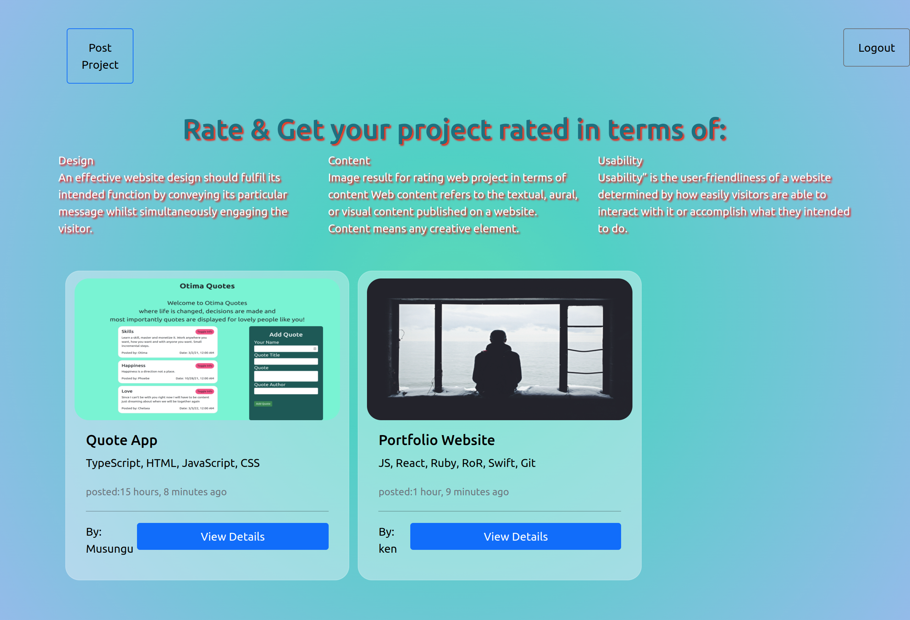
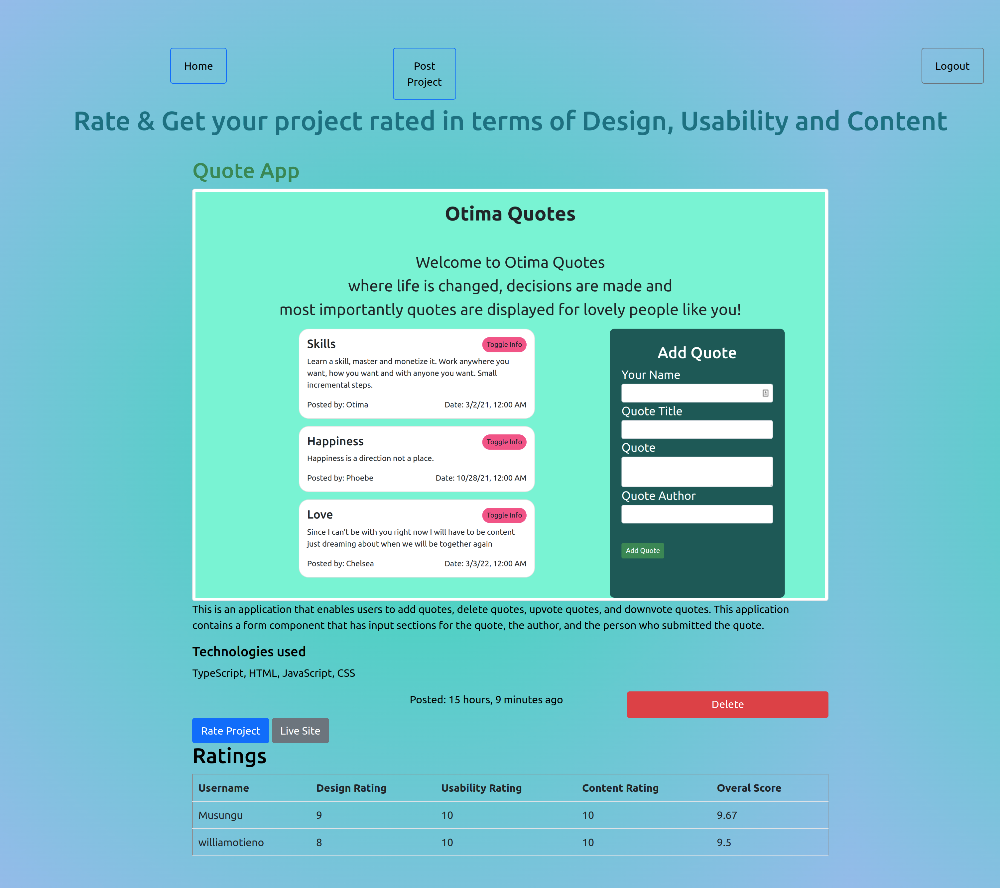

### **AWARDS**

****


#### Author: [Wayne Musungu](https://github.com/WayneMusungu)

#### **Description**
Awards is a website application where it allows authenticated users to post their projects, give a detailed information about their projects, the technologies used, an image of their projects and lastly a live link to the project. Authenticated user are able to rate a project and also view the projects overall score.

#### Livelink
https://mighty-ridge-74422.herokuapp.com/

### Screenshot
This is the home page


A users post project page



#### Setup Installation
* Copy the github repository url
* Clone to your computer
* Open terminal and navigate to the directory of the project you just cloned to your computer
* Run the following command to start the server using virtual environment
python3.8 -m venv --without-pip virtual
* To activate the virtual environment
source virtual/bin/activate
curl https://bootstrap.pypa.io/get-pip.py | python
* To run the server

``` python manage.py runserver```

### Technologies Used


* Python
* Django
* PostgresSQL
* Cloudinary
* Git Version Control

### BDD
 #### Context
  Given that a user creates an account.
 #### Event
  When the user logs in or interacts with the page
#### Outcomes
  Then a user should be able to view existing projects.\
  The user should also be able to add a review to any project.\
  The user should also be able to submit their own projects for review.\
  Each review should be in the range of 1 to 10 and is grouped into 3 categories that is its Design, Content and Usability.\
  The average rate should automatically be calculated and dispalayed for each review\
  When the user tries to query the data(from an Project's details e.g title or a user's name) only relevant posts that much the specific query should be displayed.

* [x] A user can create an account and login.
* [x] Users can add a review to a project.
* [x] Users can submit their own projects for review.
* [x] The average rate of a review is automatically calculated.
* [x] Data can be queried using the api end point `https://mighty-ridge-74422.herokuapp.com/api/projects/`

---


#### Contact Information

You can reach me on my email [waynemuyera17@gmail.com]


### License

License
MIT Copyright (c) 2022 Wayne Musungu

Permission is hereby granted, free of charge, to any person obtaining a copy of this software and associated documentation files (the "Software"), to deal in the Software without restriction, including without limitation the rights to use, copy, modify, merge, publish, distribute, sublicense, and/or sell copies of the Software, and to permit persons to whom the Software is furnished to do so, subject to the following conditions:

The above copyright notice and this permission notice shall be included in all copies or substantial portions of the Software.

THE SOFTWARE IS PROVIDED "AS IS", WITHOUT WARRANTY OF ANY KIND, EXPRESS OR IMPLIED, INCLUDING BUT NOT LIMITED TO THE WARRANTIES OF MERCHANTABILITY, FITNESS FOR A PARTICULAR PURPOSE AND NON-INFRINGEMENT. IN NO EVENT SHALL THE AUTHORS OR COPYRIGHT HOLDERS BE LIABLE FOR ANY CLAIM, DAMAGES OR OTHER LIABILITY, WHETHER IN AN ACTION OF CONTRACT, TORT OR OTHERWISE, ARISING FROM, OUT OF OR IN CONNECTION WITH THE SOFTWARE OR THE USE OR OTHER DEALINGS IN THE SOFTWARE.

=======

AWARDS